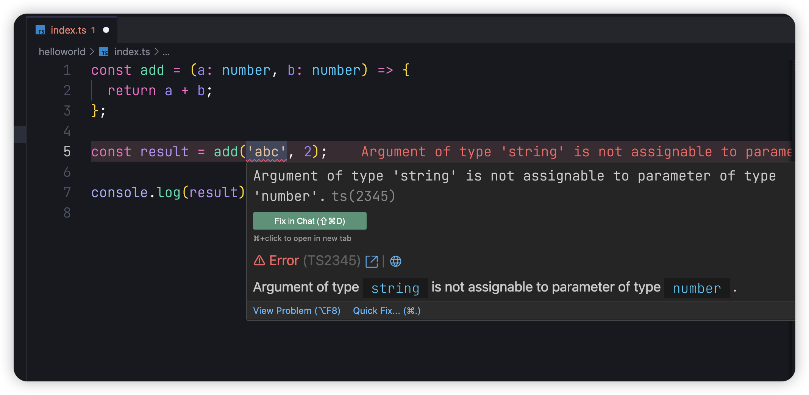
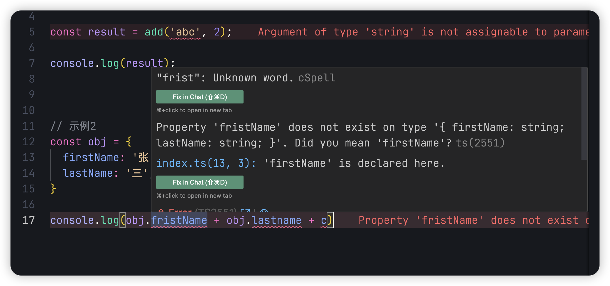
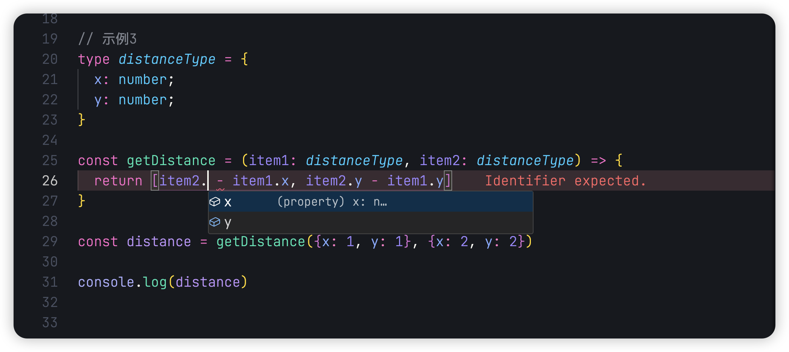
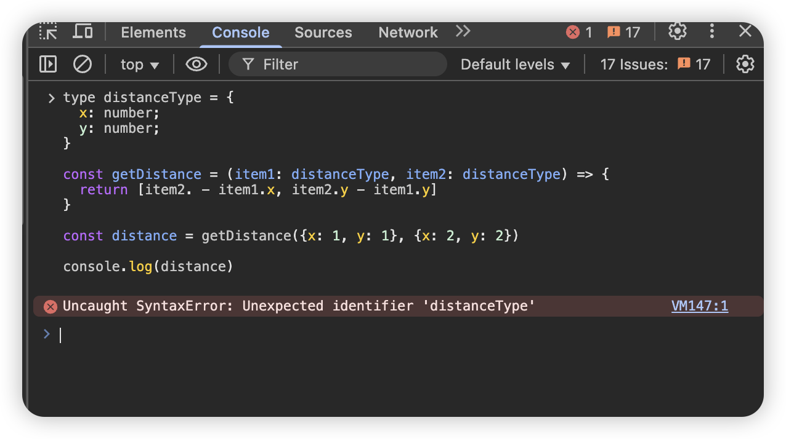

## 前言

Hello，大家好，我是三棵杨树~

欢迎阅读 **TypeScript 从零开始** 系列文章！为什么我要写这篇文章呢？其实，社区中已经有很多优秀的 TypeScript 教程，相信大家对 TypeScript 都不陌生，甚至可能已经在工作中使用了很长时间。我个人也是这样的情况，虽然在工作中频繁使用 TypeScript，但却从未深入研究过它的核心原理。

写这个系列文章的主要目的有两个：
一是从头梳理自己的 TypeScript 知识体系，填补一些可能存在的知识盲点；
二是尝试一种全新的学习方式。

以前我的学习方式主要是“输入”，很少会有“输出”。学完之后，因为缺乏实践和总结，知识很快就被遗忘，最终陷入一个怪圈：等到需要用到这项技术时，又得重新花时间去学习。这样的方式不仅浪费了时间和精力，也让技术掌握得不够扎实。

所以，这一次我希望通过这种新的学习方式来突破这个瓶颈：学完之后，用自己的思维方式重新组织并输出一遍内容。通过输出，不仅可以加深记忆，还能帮助自己真正掌握 TypeScript 的核心思想和使用技巧，希望这篇文章也能对你有所帮助！

## 介绍

### 什么是 TypeScript？

TypeScript（简称 TS）是由微软开发的一种**开源的强类型编程语言**，它是 JavaScript 的超集，能够编译为纯 JavaScript 代码。TypeScript 扩展了 JavaScript 的语法，增加了静态类型检查、接口、枚举、泛型等功能，旨在提高代码的可维护性和开发效率。

TypeScript 的核心特点包括：

- **静态类型检查**：在开发阶段就可以发现代码中的类型错误。
- **增强的开发体验**：提供代码补全、重构工具和更好的 IDE 支持。
- **兼容性**：TypeScript 代码在编译后会转换为普通的 JavaScript 代码，能够运行在任何支持 JavaScript 的环境中。

TypeScript 的文件扩展名为`.ts`，编译后的 JavaScript 文件扩展名为`.js`。

### TypeScript 与 JavaScript 的对比

| **对比点**           | **TypeScript**                                     | **JavaScript**                                             |
| -------------------- | -------------------------------------------------- | ---------------------------------------------------------- |
| **类型系统**         | 支持静态类型，开发阶段即可发现类型错误。           | 动态类型，类型错误通常在运行时才会暴露。                   |
| **开发工具支持**     | 提供更好的代码补全、重构支持和错误提示。           | 开发工具支持有限，依赖开发者手动调试和检查。               |
| **代码可维护性**     | 强类型系统和接口定义使代码更容易维护和扩展。       | 动态特性虽然灵活，但当项目规模变大时，代码维护难度会增加。 |
| **学习曲线**         | 需要学习额外的语法和概念（如类型、接口、泛型等）。 | 较为简单，直接使用即可，无需额外学习。                     |
| **运行环境**         | 需要编译为 JavaScript 后才能运行。                 | 直接运行在浏览器或 Node.js 环境中。                        |
| **错误检查**         | 编译阶段即可发现潜在错误，减少运行时错误。         | 错误通常在运行时才会暴露，可能导致运行时崩溃。             |
| **面向对象编程支持** | 提供类、接口、抽象类等完整的面向对象编程支持。     | 通过函数和原型链实现面向对象编程，支持有限。               |

### 使用示例

以下是一些使用 TypeScript 前后的对比示例，以展示 TypeScript 的优势：

#### 示例 1：动态类型错误

**JavaScript 代码**：

```javascript
const add = (a, b) => {
  return a + b;
};

const result = add('abc', 2);

console.log(result);
```

运行时会报错，但在编写代码时，编辑器不会提示任何问题。

**TypeScript 代码**：

```typescript
const add = (a: number, b: number): number => {
  return a + b;
};

const result = add('abc', 2); // 编译时错误：Argument of type 'string' is not assignable to parameter of type 'number'.

console.log(result);
```



在 TypeScript 中，编辑器会在我们尝试传入错误类型的参数时立即提示错误，避免了运行时问题。

#### 示例 2：对象属性错误

**JavaScript 代码**：

```javascript
const obj = {
  firstName: '张',
  lastName: '三',
};

console.log(obj.fristName + obj.lastname + c);
```

这里拼写错误和未定义的变量 `c` 会在运行时抛出错误，但在编写代码时没有任何提示。

**TypeScript 代码**：

```typescript
const obj: { firstName: string; lastName: string } = {
  firstName: '张',
  lastName: '三',
};

console.log(obj.fristName + obj.lastname + c); // 立即提示：Property 'fristName' does not exist on type '{ firstName: string; lastName: string }'.
```



在 TypeScript 中，编辑器会识别对象中的属性是否有效，并提示拼写错误。

#### 示例 3：参数类型提示

**JavaScript 代码**：

```javascript
const getDistance = (item1, item2) => {
  return [item2.x - item1.x, item2.y - item1.y];
};

const distance = getDistance({ x: 1, y: 1 }, { x: 2, y: 2 });

console.log(distance);
```

我们在使用参数时，并不能明确知道 `item` 对象的属性结构，也无法获得代码提示。

**TypeScript 代码**：

```typescript
type Point = { x: number; y: number };

const getDistance = (item1: Point, item2: Point): [number, number] => {
  return [item2.x - item1.x, item2.y - item1.y];
};

const distance = getDistance({ x: 1, y: 1 }, { x: 2, y: 2 });

console.log(distance);
```



当我们定义了类型 `Point` 后，编辑器会为我们提供 `item1` 和 `item2` 的属性提示，增强了开发体验和代码的可读性。

## 环境搭建

### 为什么需要编译？

TypeScript 是 JavaScript 的超集，意味着浏览器和 Node.js 并不能直接运行 TypeScript 代码。我们需要将 TypeScript 代码编译成 JavaScript 代码，才能运行。

如果我们在浏览器中直接运行 ts 代码，将会得到


### 安装 Node.js

首先需要安装 [Node.js](https://nodejs.org/en)。进入官网后，下载并安装最新的稳定版。安装完成后，在终端中输入以下命令检查安装是否成功：

```bash
node -v
```

如果输出版本号，则表示安装成功。

### 安装 TypeScript

通过 Node.js 的包管理工具（npm）安装 TypeScript：

```bash
npm install -g typescript
```

安装完成后，输入以下命令验证是否安装成功：

```bash
tsc -v
```

如果输出 TypeScript 的版本号，则说明安装成功。

### 编译 TypeScript 文件

编写一个 `index.ts` 文件，并使用以下命令将其编译为 JavaScript：

```bash
tsc index.ts
```

生成的 `index.js` 文件即可直接运行：

```bash
node index.js
```

### 使用 `tsx` 工具优化运行

在使用 TypeScript 时，每次都需要先将 `.ts` 文件编译为 `.js` 文件，再运行编译后的代码，这样的流程显得非常繁琐。为了简化这一过程，社区开发了一个工具包 **[ts-node](https://typestrong.org/ts-node/)**，它允许我们直接运行 `.ts` 文件，而无需手动编译成 `.js` 文件。

然而，`ts-node` 对于 ESM（ECMAScript Modules）的支持并不完善，因此我们可以选择一个更现代的工具 **[tsx](https://tsx.is/)**。`tsx` 能够高效运行 TypeScript 文件，同时对 ESM 提供了良好的支持。如果想了解更多关于 `tsx` 的功能，可以参考其 [官方文档](https://tsx.is/)。

安装 `tsx` 非常简单，只需运行以下命令：

```bash
npm install -g tsx
```

安装完成后，就可以使用 `tsx` 直接运行 TypeScript 文件：

```bash
tsx index.ts
```

> **注意**：`tsx` 的名称可能会让人联想到 React 中的 `.tsx` 文件格式，但它们是完全不同的概念。`tsx` 工具的命名与文件格式并无关系。

如果你不喜欢 `tsx` 的名字，也可以使用 antfu 大佬 提供的工具 **[esno](https://github.com/antfu/esno)**，它是 `tsx` 的别名，功能相同，但名称更加直观。安装和使用方法如下：

```bash
npm install -g esno
```

然后运行 TypeScript 文件：

```bash
esno index.ts
```

无论选择 `tsx` 还是 `esno`，都可以大幅提升开发效率，让我们专注于代码本身，而无需担心编译过程。

## 总结

通过本文，我们初步了解了 TypeScript 的基本概念、与 JavaScript 的核心区别，以及它在实际开发中的优势。同时，我们也学习了如何搭建 TypeScript 开发环境，以及如何高效地运行 TypeScript 文件。

TypeScript 的核心优势在于其强类型检查和开发工具的支持，这不仅提高了开发效率，还能有效避免运行时错误，使代码更稳定、更易维护。

接下来，我们将深入探索 TypeScript 的语法和核心特性，开启我们的 TypeScript 学习之旅！

如文章有错误或者不严谨的地方，期待给于指正，万分感谢。

如果你喜欢这篇文章或者有所启发，欢迎 👉 [三棵杨树](https://github.com/sankeyangshu)，给作者一些鼓励吧！

> 本文源文件都放在了  [Github](https://github.com/sankeyangshu-labs/typescript-study)  上，如果您觉得我写得还不错，希望您能给**❤️ 这篇文章点赞 [Github](https://github.com/sankeyangshu-labs/typescript-study)加星 ❤**️ 哦~
