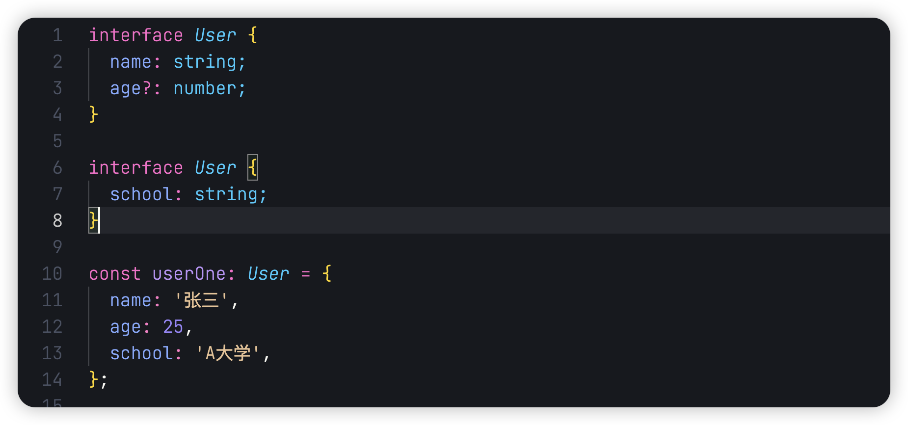
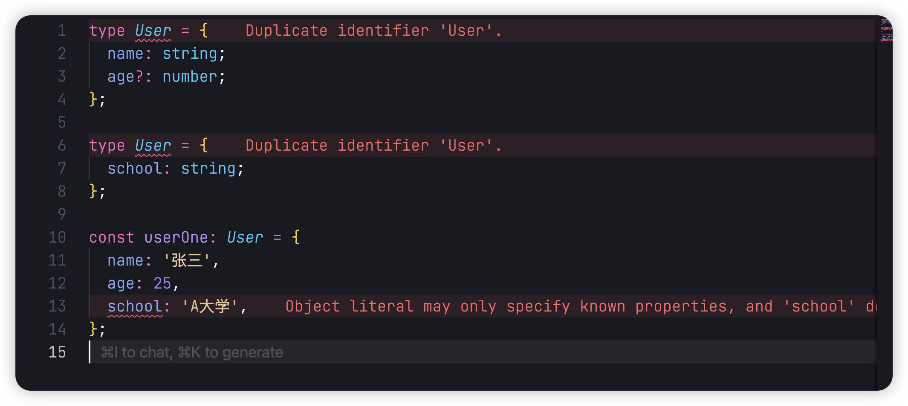
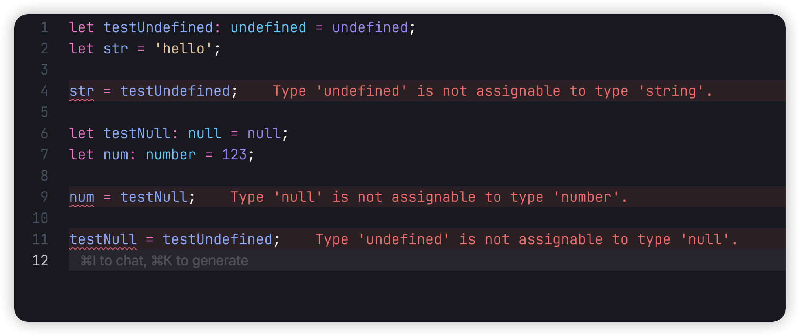
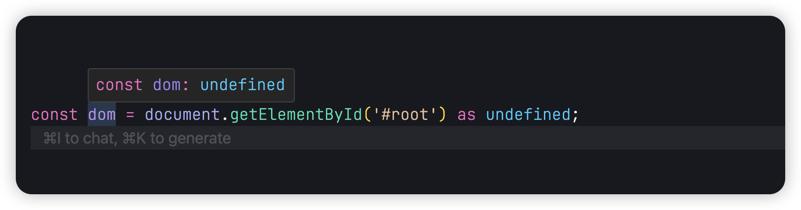
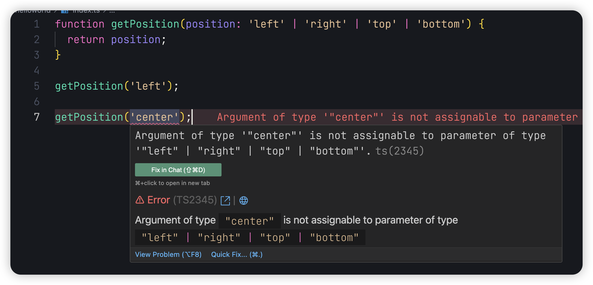
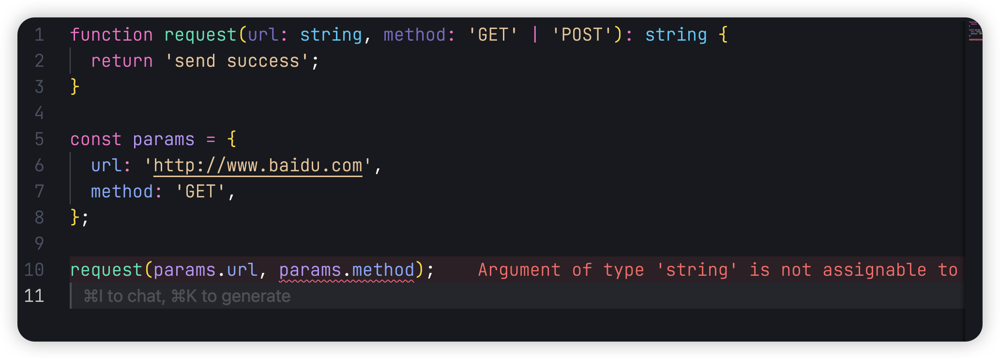
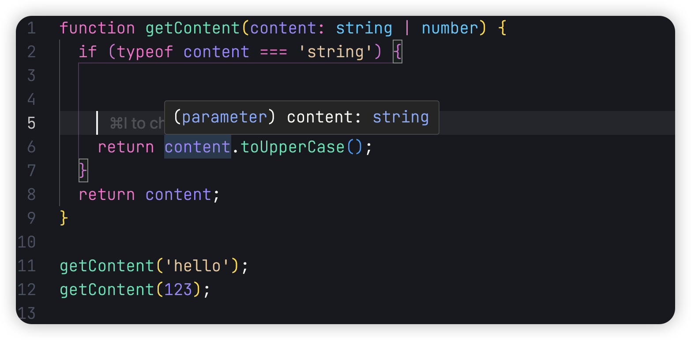
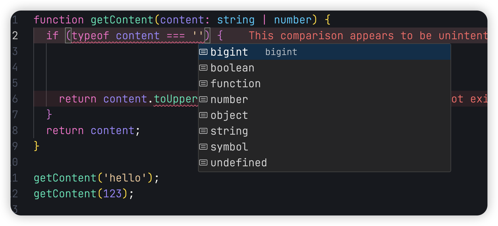
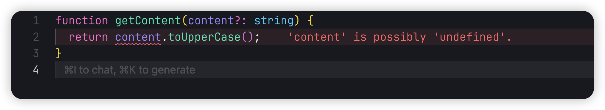
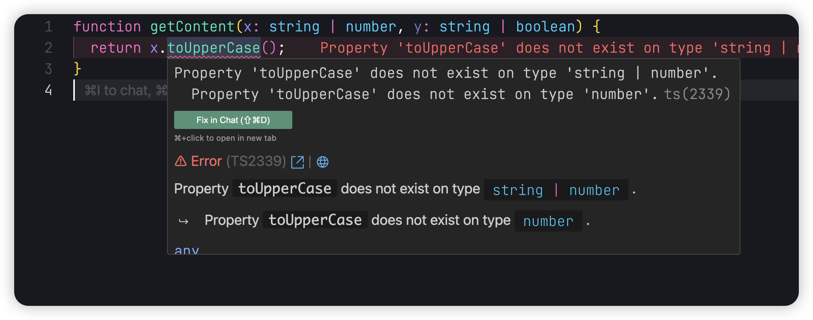

## 前言

Hello，大家好，我是三棵杨树~

欢迎阅读 **TypeScript 从零开始** 系列文章第三篇！在上一篇文章中，我们深入讲解了 TypeScript 中的基础类型，包括字符串、数字、布尔值、数组、对象、联合类型和类型别名等。此外，我们还了解了`any`类型的使用及其潜在风险。

在本篇文章中，我们将继续深入 TypeScript 的基础类型，涵盖接口（Interface）、`null` 和 `undefined` 类型、空值类型、类型断言、字面量类型、类型注解与推断，以及类型收窄等内容。通过学习这些内容，您将进一步掌握 TypeScript 的类型系统，并提升代码的安全性和可维护性。

让我们开始我们的 TS 学习之旅吧！

## 接口

在上一篇我们知道了如何使用类型别名，这里我们介绍命名对象类型的另外一种方式：接口

```typescript
interface User {
  name: string;
  age?: number;
}

const userOne: User = {
  name: '张三',
  age: 25,
};

const userTwo: User = {
  name: '李四',
};
```

类型别名和接口非常相似，在大多数情况下你可以在它们之间自由选择。 几乎所有的  `interface`  功能都可以在  `type`  中使用，接下来我们来看看两者的区别。

例如我们现在扩展类型上的属性

```typescript
// interface
interface User {
  name: string;
  age?: number;
}

interface Student extends User {
  school: string;
}

const userOne: Student = {
  name: '张三',
  age: 25,
  school: 'A大学',
};

const userTwo: Student = {
  name: '李四',
  school: 'B大学',
};

// type 使用 & 交叉类型
type User = {
  name: string;
  age?: number;
};

type Student = User & {
  school: string;
};

const userOne: Student = {
  name: '张三',
  age: 25,
  school: 'A大学',
};

const userTwo: Student = {
  name: '李四',
  school: 'B大学',
};
```

使用 interface，我们可以通过继承来扩展类型，可以很方便的定义新的类型。如果使用 type，我们需要使用`&` 交叉类型来扩展类型。两种使用方式看开发者的喜好自由选择。

但是 interface 可以自动合并同名类型，而 type 不可以



## null 和 undefined 类型

```typescript
const testUndefined: undefined = undefined; // 定义undefined
const testNull: null = null; // 定义null
```

null 和 undefined 是所有类型的子类型，也就是说我们可以将 null 或者 undefined 类型的变量赋值给 string 或 number 等类型的变量

```typescript
let testUndefined: undefined = undefined;
let str = 'hello';

str = testUndefined;

let testNull: null = null;
let num: number = 123;

num = testNull;

// 同时我们也可以将null和undefined互相赋值
testNull = num;
```

但是如果你配置了 `tsconfig.json`，并开启了**strictNullChecks**

```json
{
  "compilerOptions": {
    "strictNullChecks": true
  }
}
```

这样 TS 就会对 null 和 undefined 进行严格校验


## 空值类型

在 TypeScript 中，void 用来表示没有任何返回值的函数

```typescript
function noop(): void {
  return;
}
```

在 JavaScript 中没有空值（void）的概念，对于没有任何返回值的函数，JavaScript 将隐式返回值`undefined`，但是 `void` 和 `undefined` 在 TypeScript 中并不是一回事。

```typescript
// void可以接收undefined值
let voidVar: void = undefined;

// 函数返回类型不同
function returnsVoid(): void {
  return;
}
function returnsUndefined(): undefined {
  return undefined;
}

// 在严格模式下，void类型变量不能赋给其他类型
// 但undefined类型变量可以赋给有undefined联合的类型
type MaybeString = string | undefined;
let str: MaybeString = undefined;
```

## 类型断言

```typescript
const dom: HTMLElement = document.getElementById('#root');
```

上面的代码在编辑器中不会报错，但是我们知道这段代码并不安全，因为我们的页面结构中可能不存在 root 这个节点，但是 TypeScript 并不知道，这个时候就需要我们来给他进行类型断言，告诉编辑器这个节点并不存在。

类型断言使用 `as` 这个关键字

```typescript
const dom: HTMLElement = document.getElementById('#root') as undefined;
```


这个时候 TypeScript 就可以推断出这个 dom 的类型是`undefined`了

## 字面量类型

什么是字面量类型，就是类型字面上代表的意思。例如下面的例子中，我们创建一个函数，我们设置了字面量类型，那么我们在传参的时候，只能是这四个值中的某一个，如果我们传入别的值，那么编辑器就会报错



我们在看下面一个例子


这个时候我们就发现了，当我们使用字面量类型的时候， 虽然例子中的类型值是 string，但是我们使用 string 作为类型的话，TypeScript 就会告诉我们 string 无法传递给字面量类型。这个时候我们有两种方法来处理这个问题

1. 在任意位置添加类型断言来处理

```typescript
// 第一种
const params = {
  url: 'http://www.baidu.com',
  method: 'GET' as 'GET',
};

// 第二种
request(params.url, params.method as 'GET');
```

2. 可以使用`as const`将整个对象转换为类型文字

```typescript
const params = {
  url: 'http://www.baidu.com',
  method: 'GET',
} as const;

request(params.url, params.method);
```

`as const`的作用类似于 const，但是对于类型系统而言，它确保所有属性都被分配字面量类型，而不是更通用的版本，如`string`或`number` 。

## 类型注解和类型推断

类型注解就是之前我们文章中一直使用的方式，通过`: 类型`告诉 TypeScript，变量或者对象的属性类型

```typescript
// 类型注解，人工告诉TS，变量或者对象的明确属性类型
const userName: string = '张三';
```

但是这种方式对于开发者来说，每次都要手动添加类型，也是一种负担。所以 TypeScript 允许我们不写类型，它可以自动帮我们推导类型

```typescript
const userName = '张三';

userName.toLowerCase();
```

如果类型推导能够自动推断出类型，就没必要去手写类型注解。

## 类型收窄

### typeof

在上一章中的联合类型，我们已经使用过了`typeof`进行过类型收窄了



这样我们获取的参数类型就是收窄过后的类型了，但是`typeof`并不能判断所有的类型，它只支持`string`、`number`、`boolean`、`symbol`、`bigint`、`undefined`、`function` 和 `object`



### 真值收窄



当我们使用可选属性的时候，参数可能不存在，这个时候我们可以使用真值收窄来进行处理

```typescript
function getContent(content?: string) {
  if (content) {
    return content.toUpperCase();
  }
}
```

### 相等收窄


当遇到两个参数有相同的类型时，我们需要使用其中一个参数上的方法，我们就可以使用相等收窄，这样 TypeScript 就会认为 x 和 y 一定是 string 类型。

```typescript
function getContent(x: string | number, y: string | boolean) {
  if (x === y) {
    return x.toUpperCase();
  }
}
```

### in

```typescript
type Fish = {
  swim: () => void;
};

type Bird = {
  fly: () => void;
};

function test(animal: Fish | Bird) {
  // 使用 in 语法进行类型收窄
  if ('swim' in animal) {
    animal.swim();
  } else {
    animal.fly();
  }
}
```

### 类型陈述

除了通过`in`进行类型收窄，我们也可以使用`is`来判断类型

`is` 类型谓词的语法为 `parameterName is Type`，它告诉 TypeScript 编译器：

- 如果函数返回  `true`，参数的类型就是指定的类型
- 这样在条件判断中可以实现类型缩窄(type narrowing)

```typescript
type Fish = {
  swim: () => void;
};

type Bird = {
  fly: () => void;
};

// 使用 is 类型陈述
function isFish(animal: Fish | Bird): animal is Fish {
  if ((animal as Fish).swim !== undefined) {
    return true;
  }
  return false;
}

function test(animal: Fish | Bird) {
  if (isFish(animal)) {
    animal.swim();
  } else {
    animal.fly();
  }
}
```

## 总结

在本文中，我们深入学习了 TypeScript 的基础类型，包括接口的使用及其与类型别名的区别、`null` 和 `undefined` 的特性、`void` 和 `undefined` 的不同、类型断言的用法、字面量类型的应用，以及类型注解、类型推断和类型收窄的多个方法。

通过掌握这些内容，开发者可以更高效地使用 TypeScript 的类型系统，编写出类型安全、可维护的代码。

如文章有错误或者不严谨的地方，期待给于指正，万分感谢。

如果你喜欢这篇文章或者有所启发，欢迎 👉 [三棵杨树](https://github.com/sankeyangshu)，给作者一些鼓励吧！

> 本文源文件都放在了  [Github](https://github.com/sankeyangshu-labs/typescript-study)  上，如果您觉得我写得还不错，希望您能给**❤️ 这篇文章点赞 [Github](https://github.com/sankeyangshu-labs/typescript-study)加星 ❤**️ 哦~
