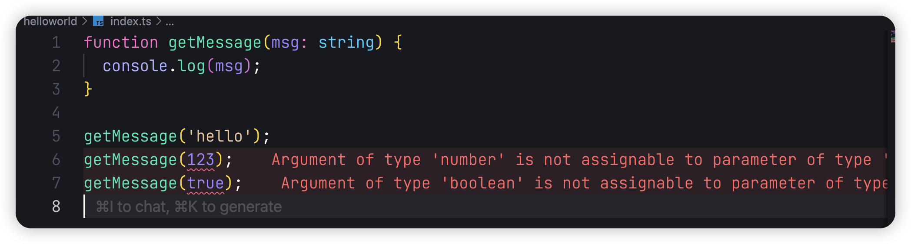
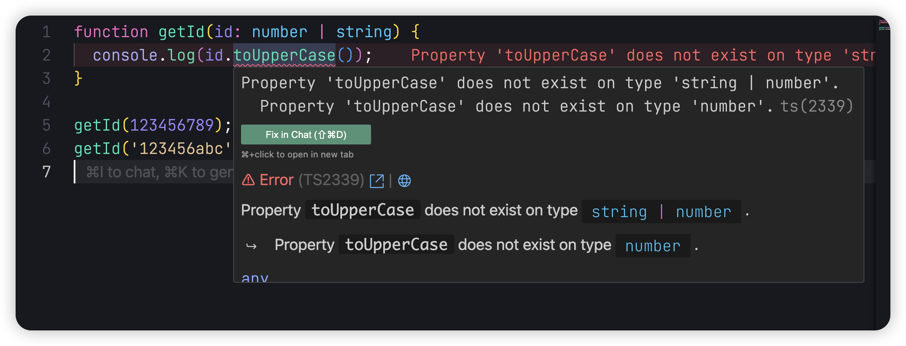
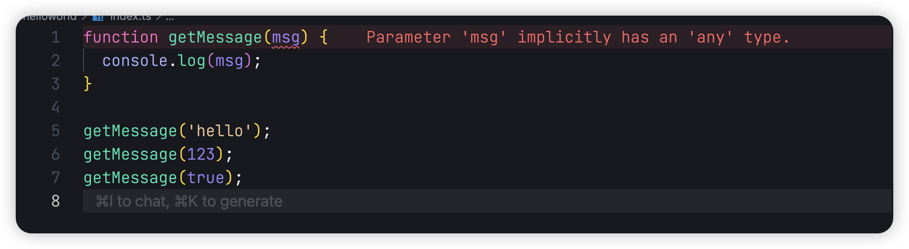

## 前言

Hello，大家好，我是三棵杨树~

欢迎阅读 **TypeScript 从零开始** 系列文章第二篇！在上一篇文章中，我们已经对 TypeScript 有了一个初步的了解，知道了它是如何帮助我们在 JavaScript 的基础上提升代码的可读性和可维护性，并且初步搭建了 TypeScript 的开发环境。

在本篇文章中，我们将深入探讨 **TypeScript 的基础类型**。了解基础类型是学习 TypeScript 的第一步，它能够帮助我们编写更稳定、更安全的代码。同时，掌握基础类型还为后续学习接口、泛型等更复杂的特性打下坚实的基础。

无论你是刚接触 TypeScript 的新手，还是希望系统学习的开发者，这篇文章都会为你提供详细的讲解与示例，帮助你加深对基础类型的理解。

让我们开始我们的 TS 学习之旅吧！

## 基本数据类型

我们知道 JavaScript 定义了 8 种内置类型：Number、String、BigInt、Boolean、Symbol、Null、Undefined、Object。

所以 TypeScript 也提供了与内置类型相对应的原始类型：`number`、`string`、`boolean`、`null`、`undefined`、`symbol`、`bigint`、`object`。接下来我们将逐一介绍这些类型。

### 字符串类型

字符串类型通过 **string** 来定义，在 TypeScript 中，我们可以通过在变量后面添加 `: 类型` 来给变量定义类型。

```typescript
const str: string = 'hello world';

// 或者也可以使用es6的模版字符串
const str2: string = `hello ${str}`;
```

### 数字类型

数字类型使用 **number** 来定义。JavaScript 没有整数的特殊运行时值，一切数字都是`number`类型。

```typescript
const num: number = 123; // 普通数字
const decimals: number = 3.14; // 小数
const infinityNumber: number = Infinity; // 无穷大
```

同时数字类型还支持二进制，八进制，十进制和十六进制

```typescript
const binary: number = 0b1010; // 二进制
const octal: number = 0o744; // 八进制
const decimal: number = 6; // 十进制
const hex: number = 0xf00d; // 十六进制
```

还有一个特殊的值在 TS 中也是 **number** 类型

```typescript
const notANumber: number = NaN; // NaN
```

### 布尔类型

布尔类型通过 **boolean** 来定义，用来表示`true`和`false`两个值

```typescript
const isTrue: boolean = true;
const isFalse: boolean = false;
```

那么有人会有疑问，类型一定要是小写字母吗，如果我写成大写字母会怎么样？

事实上 `number` 是原始类型，`Number` 是对象类型，使用 `number` 时，值是原始的，而使用 `Number` 时，值是一个对象。

```typescript
const num: number = 42; // 原始类型
const obj: Number = new Number(42); // 对象类型

console.log(typeof num); // 输出 "number"
console.log(typeof obj); // 输出 "object"
```

## 数组类型

在 TypeScript 中，我们如果想给一个数组定义类型该如何做呢？

```typescript
const arr: number[] = [1, 2, 3];
```

我们可以使用上面的语法`类型[]`定义一个数字类型数组，当然这种语法适用任何类型（例如 `string[]`适用于字符串数组等等），我们还可以使用另外一种语法`Array<number>`来定义数组类型

```typescript
const arr: Array<number> = [1, 2, 3];
```

这种写法叫做**泛型**，在介绍**泛型**时，我们将详细了解语法`T<U>`

## 函数类型

上面我们知道了如何给变量设置类型，那么如何给函数设置类型呢？

在声明函数时，我们可以在每个参数后添加类型注释，以声明该函数接受的参数类型

```typescript
function getMessage(msg: string) {
  console.log(msg);
}

getMessage('hello');
```

这样当我们传入类型不正确的参数是，TS 就可以提示我们类型错误

当然我们也可以对函数的返回值设置类型

```typescript
function getMessage(msg: number): string {
  console.log(msg);
  return 'hello world';
}

getMessage(123);
```

## 对象类型

除了上面的基本类型之外，在 JavaScript 中，我们最常用的就是对象了，那么我们该如何定义对象类型呢？

```typescript
const user: {
  name: string;

  age: number;
} = {
  name: '张三',

  age: 25,
};
```

但是有的时候，我们并不想传全部的值，那么我们可以通过`?`来设置可选

```typescript
const user: {
  name: string;

  age?: number;
} = {
  name: '张三',
};
```

## 联合类型

当我们遇到这种情况时，我们需要获取用户的 ID，但是用户的 ID 有可能存在特殊字符，这样我们就不能仅仅只设置 ID 为 number 类型了，那么这种时候我们就可以使用联合类型，通过 `|` 符号可以定义联合类型：

```typescript
function getId(id: number | string) {
  console.log(id);
}

getId(123456789);

getId('123456abc');
```

使用联合类型时，TypeScript 仅允许对每个成员都有效的操作，例如上面的例子，我们设置 ID 类型为`string | number`，那么我们在使用 id 的时候，就不能使用仅适用于 string 的方法


那么遇到这种情况，如果说我们想使用`string`上的方法，我们可以通过类型收窄来进行操作

```typescript
function getId(id: number | string) {
  if (typeof id === 'string') {
    console.log(id.toUpperCase());
  } else {
    console.log(id);
  }
}

getId(123456789);

getId('123456abc');
```

## 类型别名

在上面的对象类型中，我们设置了`user`对象的类型，但是如果对象里的属性很多的话，每次我们都要写一长串类型，这样太麻烦了，这种情况我们就可以使用类型别名`type`来解决类型复用的问题

```typescript
type User = {
  name: string;
  age: number;
};

const userOne: User = {
  name: '张三',
  age: 25,
};

const userTwo: User = {
  name: '李四',
  age: 18,
};
```

## 任何类型

在 TypeScript 中，有时候我们会遇到不知道给参数设置什么类型的情况，这个时候我们就可以使用`any`类型。

当你使用 any 类型的时候，意味着你可以访问它的任何属性，像函数一样调用它，或者把它分配给（或从）任何类型的值，这个时候 TypeScript 不会执行任何检查，就像我们写 JavaScript 一样。但是这样也就失去了 TypeScript 类型检测的作用。

```typescript
let testAny: any = 123;
testAny = 'hello';
testAny = true;
```

如果我们在声明变量的时候，没有显式的设置类型，那么该变量就默认为 any 类型

```typescript
function getMessage(msg) {
  console.log(msg);
}

getMessage('hello');

getMessage(123);

getMessage(true);
```

不过我们可以通过设置`noImplicitAny`来避免任何隐式`any`类型

```json
{
  "compilerOptions": {
    "noImplicitAny": true
  }
}
```



## 总结

在本篇文章中，我们深入讲解了 TypeScript 中的基础类型，包括字符串、数字、布尔值、数组、对象、联合类型和类型别名等。此外，我们还了解了`any`类型的使用及其潜在风险。

掌握这些基础类型是学习 TypeScript 的第一步，它为后续学习接口、泛型等内容打下了坚实的基础。

如文章有错误或者不严谨的地方，期待给于指正，万分感谢。

如果你喜欢这篇文章或者有所启发，欢迎 👉 [三棵杨树](https://github.com/sankeyangshu)，给作者一些鼓励吧！

> 本文源文件都放在了  [Github](https://github.com/sankeyangshu-labs/typescript-study)  上，如果您觉得我写得还不错，希望您能给**❤️ 这篇文章点赞 [Github](https://github.com/sankeyangshu-labs/typescript-study)加星 ❤**️ 哦~
