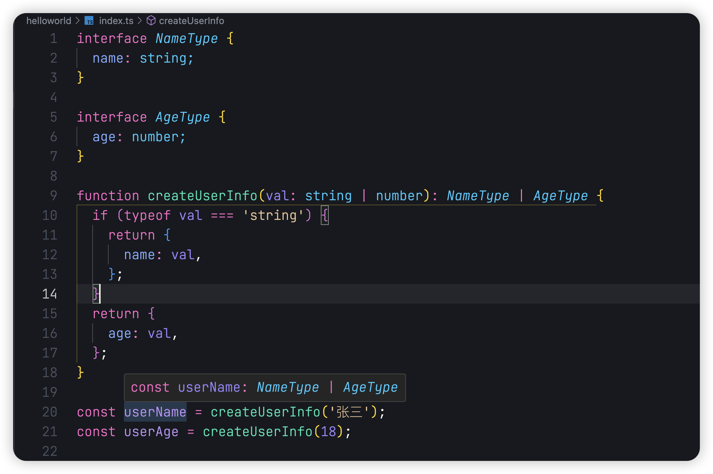
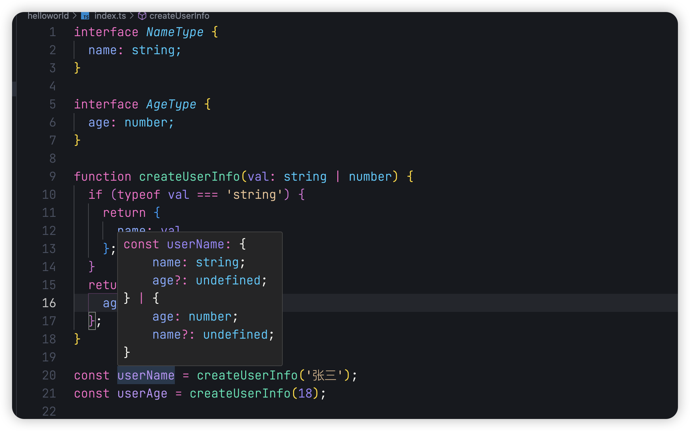
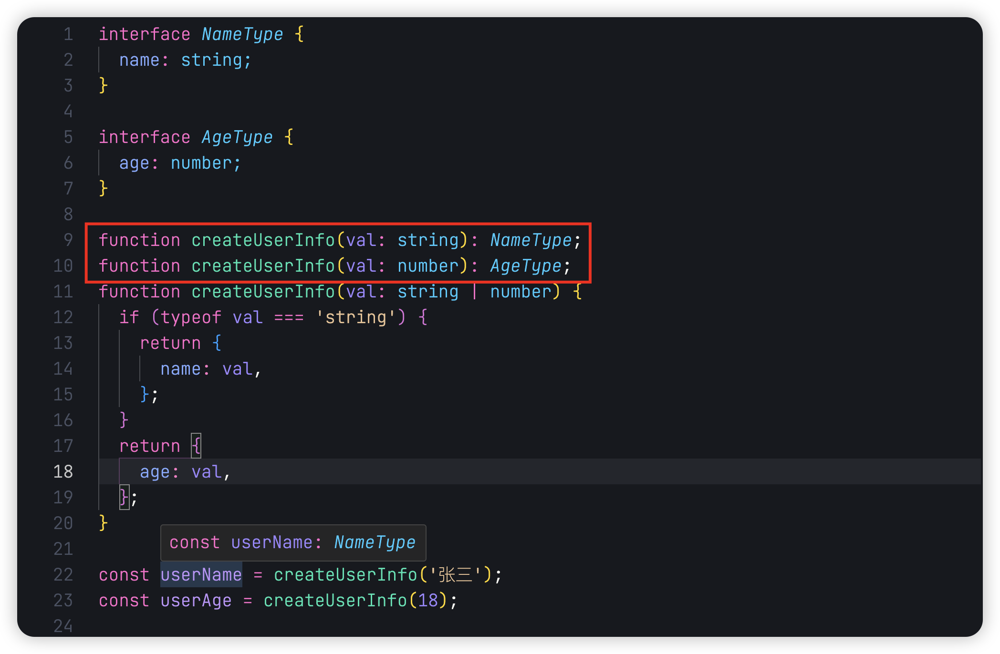
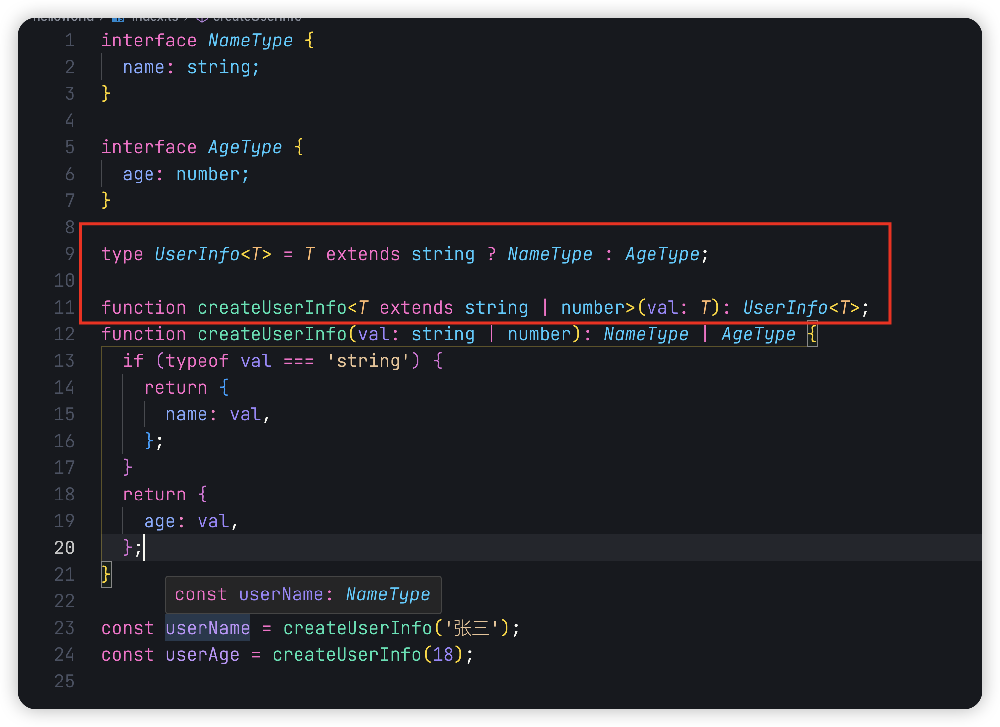
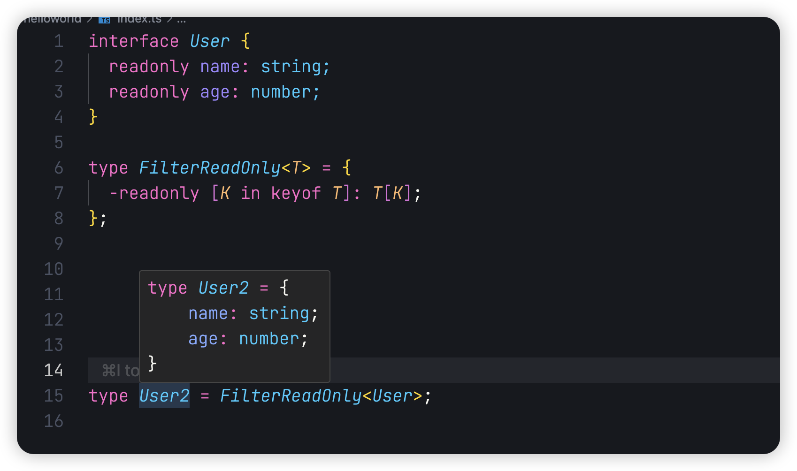

## 前言

Hello，大家好，我是三棵杨树~

欢迎阅读 **TypeScript 从零开始** 系列文章第五篇！在前几篇文章中，我们详细讲解了 TypeScript 的基础类型、泛型等核心概念。随着代码复杂度的提高，我们难免会遇到需要根据类型动态生成新类型的场景，而这正是条件类型和映射类型的用武之地。

本篇文章将重点介绍条件类型与映射类型的概念和使用场景，帮助您更灵活地操作和转换类型。

让我们开始我们的 TS 学习之旅吧！

## 条件类型

条件类型是 TypeScript 中的一种高级类型构造方式，允许根据类型关系选择不同的类型。它的语法类似于 JavaScript 的三元条件表达式。

```typescript
// 基本语法
T extends U ? X : Y
```

以下是一个简单的条件类型示例，用来判断某个类型是否为 `string` ：

```typescript
type IsString<T> = T extends string ? 'yes' : 'no';

type A = IsString<string>; // 'yes'
type B = IsString<number>; // 'no'
```

让我们来实际应用一下条件类型，我们创建一个函数来写入用户姓名或年龄。我们想实现这样的一个效果，当我们传入的值为 `string` 的时候，就写入到用户姓名；如果传入的值为 `number` 就写入到年龄中。

```typescript
interface NameType {
  name: string;
}

interface AgeType {
  age: number;
}

function createUserInfo(val: string | number): NameType | AgeType {
  if (typeof val === 'string') {
    return {
      name: val,
    };
  }
  return {
    age: val,
  };
}

const userName = createUserInfo('张三');
const userAge = createUserInfo(18);
```

当我们调用函数写入信息时，希望他的返回值是对应的信息。例如 `userName` 的类型为 `NameType`。但是实际上，TypeScript 推断的类型是

有人说这是因为你在函数上指定了返回值的类型，那么去掉函数的返回值类型

如果我们想解决这个问题，我们以前的方法是写类型重载

这样问题就解决了，但是这样的写法有不足之处，如果后面我们需要传入不同的类型，例如`boolean`，那么我们就得不断地在上面添加新的类型重载，这样代码太过冗余。我们用条件类型来解决这个问题


这样我们就把多行类型重载重构成一行代码，使代码更加简练

### infer

`infer` 是 TypeScript 中的条件类型推断关键字，用于在条件类型中提取和推断类型。它只能在 `extends` 条件类型的 `true` 分支中使用。

```typescript
type ReturnType<T> = T extends (...args: any[]) => infer R ? R : any;

// 使用示例
function foo(): number {
  return 42;
}

type FooReturnType = ReturnType<typeof foo>; // number
```

## 映射类型

映射类型是 TypeScript 中的一种高级类型构造方式，允许你基于旧类型创建新类型，通过遍历现有类型的属性并应用转换来创建新的类型结构。

```typescript
type MappedType<T> = {
  [P in keyof T]: TransformedType;
};

// 1. `keyof T` 获取 T 的所有属性名作为联合类型
// 2. `P in keyof T` 遍历这些属性
// 3. 为每个属性应用转换，产生新的类型
```

### 常用映射类型

#### 只读类型

`Readonly` 将类型的所有属性变为只读：

```typescript
interface User {
  name: string;
  age: number;
}

type ReadonlyUser = Readonly<User>;
// 等同于
// {
//   readonly name: string;
//   readonly age: number;
// }
```

`Readonly` 的实现方法如下：

```typescript
type Readonly<T> = {
  readonly [K in keyof T]: T[K];
};
```

#### 可选类型

`Partial` 将类型的所有属性设置为可选：

```typescript
interface User {
  name: string;
  age: number;
}

type PartialUser = Partial<User>;
// 等同于
// {
//   name?: string;
//   age?: number;
// }
```

`Partial` 的实现方法如下：

```typescript
type Partial<T> = {
  [P in keyof T]?: T[P];
};
```

#### Pick

`Pick` 从类型中选择某些属性：

```typescript
interface User {
  name: string;
  age: number;
}

// 使用示例
type NameOnly = Pick<User, 'name'>;
// 等同于:
// {
//   name: string;
// }
```

`Pick` 的实现方法如下：

```typescript
type Pick<T, K extends keyof T> = {
  [P in K]: T[P];
};
```

#### Record

`Record` 可以把类型分配给我们传入的参数：

```typescript
interface User {
  name: string;
  age: number;
}

// 使用示例
type UserExample = Record<'employee' | 'manager', User>;
// 等同于:
// {
//   employee: Person;
//   manager: Person;
// }
```

`Record` 的实现方法如下：

```typescript
type Record<K extends keyof any, T> = {
  [P in K]: T;
};
```

上面列举出的是几个比较常用的映射类型。

### 高级映射类型

#### 条件映射类型

条件映射类型结合条件类型和映射类型的特性。例如，我们可以将 `User` 类型中所有的 `string` 属性转换为 `string[]`：

```typescript
interface User {
  name: string;
  age: number;
  isActive: boolean;
}

// 使用条件映射类型
type ExampleUser<T> = {
  [P in keyof T]: T[P] extends string ? string[] : T[P];
};

type UserExample = ExampleUser<User>;
// 等同于:
// {
//   name: string[];
//   age: number;
//   isActive: boolean;
// }
```

#### 使用  `-`  修饰符移除属性

我们有一个类型 `User`，它里面的属性都是只读的，如果我们想定义一个新的类型，让 `User` 里的属性不再是只读的，在之前的话，我们只能重新复制该类型，并手动一个个去掉 `readonly`，那么有没有一种更快捷的修改类型的方式呢？

```typescript
interface User {
  readonly name: string;
  readonly age: number;
}
```

我们可以使用映射类型来解决这个问题，通过  `-`  修饰符移除属性


#### 使用  `as`  子句重映射键名

我们现在想构建一个新的类型，他可以获取`User` 类型上属性的值，并且属性命名方式按照 **getXxxx** 来命名，我们可以通过 `as` 来重映射键名

```typescript
interface User {
  name: string;
  age: number;
  sex: boolean;
}

type GetUserType<T> = {
  [P in keyof T as `get${Capitalize<string & P>}`]: () => T[P];
};

type UserExample = GetUserType<User>;
// 等同于:
// {
//   getName: () => string;
//   getAge: () => number;
//   getSex: () => boolean;
// }
```

`Capitalize` 可以将我们传入的值转变为首字母大写

## 总结

在本文中，我们详细介绍了 TypeScript 中的条件类型与映射类型。条件类型让我们可以根据类型关系动态选择类型，而映射类型提供了强大的工具来操作和转换类型结构。通过这些特性，TypeScript 的类型系统更加灵活且强大，能够适应复杂的需求。

希望通过本篇文章，您对条件类型与映射类型有了更深的理解，并能够在实际开发中灵活运用。

如文章有错误或者不严谨的地方，期待给于指正，万分感谢。

如果你喜欢这篇文章或者有所启发，欢迎 👉 [三棵杨树](https://github.com/sankeyangshu)，给作者一些鼓励吧！

> 本文源文件都放在了  [Github](https://github.com/sankeyangshu-labs/typescript-study)  上，如果您觉得我写得还不错，希望您能给**❤️ 这篇文章点赞 [Github](https://github.com/sankeyangshu-labs/typescript-study)加星 ❤**️ 哦~
