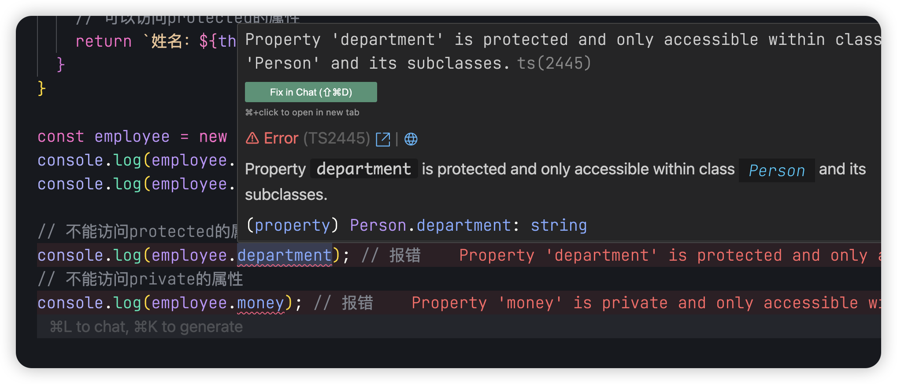
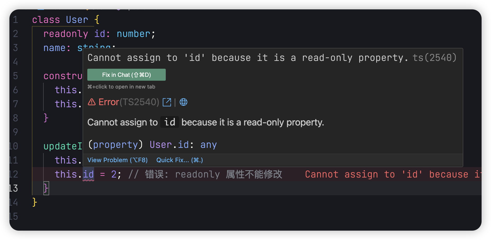
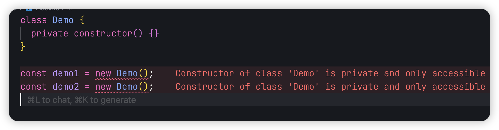
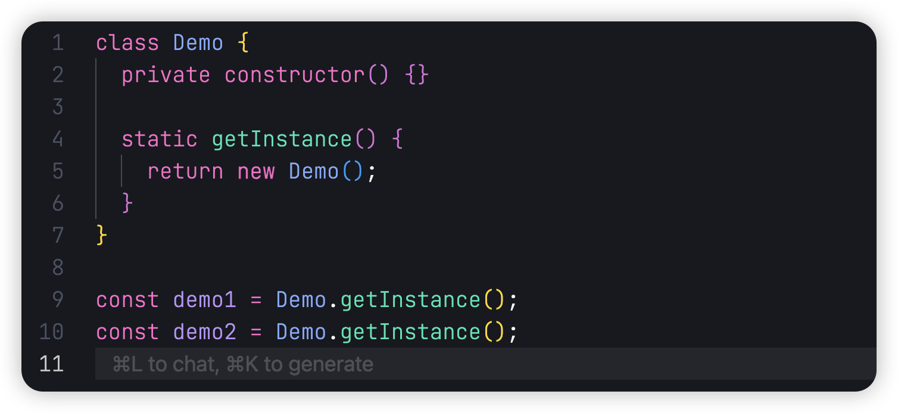

## 前言

Hello，大家好，我是三棵杨树~

欢迎阅读 **TypeScript 从零开始** 系列文章第六篇！在之前的文章中，我们已经学习了 TypeScript 的基础类型、泛型、条件类型和映射类型等核心概念。

本篇文章，我们将深入探讨 TypeScript 中的类（Class）特性，包括访问修饰符、静态成员、抽象类等进阶内容，帮助你更好地掌握面向对象编程在 TypeScript 中的应用。

让我们开始我们的 TS 学习之旅吧！

## 基本语法

我们知道在 ES6 中引入了 `class` 关键字，为 JavaScript 提供了更清晰、更面向对象的语法糖，使创建和继承基于原型的类变得更加简单和直观。

```javascript
class Person {
  name = '张三';

  getName() {
    return this.name;
  }
}

const person = new Person();
console.log(person.getName()); // 张三
```

上面就是 class 在 JavaScript 中的基本使用，那么在 TypeScript 中对类进行了那些扩展呢？

## 类型系统

```typescript
class Person {
  name: string;
  age: number;

  constructor(name: string, age: number) {
    this.name = name;
    this.age = age;
  }

  getName(): string {
    return this.name;
  }

  getAge(): number {
    return this.age;
  }
}

const person = new Person('张三', 20);
console.log(person.getName()); // 张三
console.log(person.getAge()); // 20
```

TypeScript 为 JavaScript 中的类添加了类型系统，使得 class 在使用时更加类型安全，能够在编译时捕获潜在的错误。

## 访问修饰符

接下来让我们了解 `public`、`private`、`protected` 这三个访问修饰符的作用：

```typescript
class Person {
  // public 公有属性，可以在类内部和外部访问。可以在前面不加访问修饰符，默认是public
  public name: string;
  // protected 受保护属性，只能在类内部和子类中访问
  protected department: string;
  // private 私有属性，只能在类内部访问
  private money: number;

  constructor(name: string, department: string, money: number) {
    this.name = name;
    this.department = department;
    this.money = money;
  }

  getUserInfo() {
    // 在类内部可以访问private的属性
    return `姓名：${this.name}，部门：${this.department}，工资：${this.money}`;
  }
}

class Employee extends Person {
  getDetails() {
    // 可以访问protected的属性
    return `姓名：${this.name}，部门：${this.department}`;
    // 不能访问private的属性
    // return `工资：${this.money}`; // 错误
  }
}

const employee = new Employee('张三', '技术部', 10000);
console.log(employee.getUserInfo()); // 姓名：张三，部门：技术部，工资：10000
console.log(employee.getDetails()); // 姓名：张三，部门：技术部

// 可以访问public属性
console.log(employee.name); // 张三
// 不能访问protected和private的属性
// console.log(employee.department); // 错误
// console.log(employee.money); // 错误
```

如果我们尝试在类外部访问 `protected` 或 `private` 修饰的属性，TypeScript 会报错：



除了上面三个访问修饰符，TypeScript 还提供了 `readonly` 修饰符，用于创建只读属性：

```typescript
class User {
  readonly id: number;
  name: string;

  constructor(id: number, name: string) {
    this.id = id;
    this.name = name;
  }

  updateInfo(name: string) {
    this.name = name; // 可以修改
    // this.id = 2; // 错误: readonly 属性不能修改
  }
}
```



TypeScript 还支持参数属性简写，这种写法可以在构造函数参数中直接声明并初始化类属性：

```typescript
class User {
  // 简写方式，自动创建并初始化 id、name 和 age 属性
  constructor(
    readonly id: number,
    public name: string,
    protected age: number
  ) {}

  getUserInfo() {
    return `name: ${this.name}, age: ${this.age}`;
  }
}

const user = new User(1, '张三', 20);
console.log(user.getUserInfo());
```

## Setter 和 Getter

在上面访问修饰符中，我们知道当一个属性设置成 `private` 的时候，是不能通过外部访问或修改它的，但是有的时候我们需要再外面访问或修改它，那么我们就可以通过 `get` 和 `set` 来进行操作

```typescript
class Person {
  constructor(private _name: string) {}

  // 访问器，允许外部读取私有属性
  get name(): string {
    return this._name;
  }

  // 设置器，允许外部修改私有属性
  set name(value: string) {
    this._name = value;
  }
}

const person = new Person('张三');
console.log(person.name); // 张三

person.name = '李四';
console.log(person.name); // 李四
```

这样我们就可以对类中的私有属性进行修改值或获取值了

## 静态属性与方法

静态属性和方法属于类本身而非类的实例，可以通过类名直接访问，而无需创建实例：

```typescript
class Calculator {
  // 静态属性
  static PI: number = 3.14159;

  // 静态方法
  static square(x: number): number {
    return x * x;
  }

  // 实例方法可以访问静态属性
  calculateCircleArea(radius: number): number {
    return Calculator.PI * radius * radius;
  }
}

// 直接通过类名访问静态成员
console.log(Calculator.PI); // 3.14159
console.log(Calculator.square(5)); // 25

// 创建实例使用实例方法
const calc = new Calculator();
console.log(calc.calculateCircleArea(5)); // 78.53975

// 实例不能直接访问静态属性
// console.log(calc.PI); // 错误：属性'PI'不存在于'Calculator'的实例上
```

结合上面的知识，我们来实现一个单例模式

首先实现单例模式，我们就要限制不能通过外部 `new` 的方法来创建类的实例，那么如何限制呢？我们可以在构造器前面加上 `private` 修饰符使其变成私有，这样我们就限制了外面创建实例的这种情况


我们规避了创建实例这种情况，那么我们该如何创建唯一的类实例呢？我们可以使用 `static` 来实现一个静态方法，将方法挂载类本身上，通过它来创建实例


但是这样又有一个新的问题，我们通过静态方法创建的实例，但是每一次我们调用该方法的时候，它都会创建一个新的实例。我们可以再创建一个私有的静态属性来控制方法创建实例

```typescript
class Demo {
  private static instance: Demo;
  private constructor() {}
  static getInstance() {
    if (!this.instance) {
      this.instance = new Demo();
    }
    return this.instance;
  }
}

const demo1 = Demo.getInstance();
const demo2 = Demo.getInstance();
console.log(demo1 === demo2); // true
```

这样我们就实现了一个单例模式，也通过单例模式将我们前面所学的知识使用起来了

## 抽象类

当我们有很多类的时候，这些类中都有几个同样的方法，例如下面的几个类都有 `getArea` 这个方法

```typescript
class Circle {
  getArea() {}
}

class Square {
  getArea() {}
}

class Rectangle {
  getArea() {}
}
```

那么我们就可以定义一个抽象类将这几个类中具有共性的方法抽离出来，通过继承，让子类来实现该方法

```typescript
abstract class Geometry {
  // 抽象方法必须由子类实现
  abstract getArea(): number;
}

class Circle extends Geometry {
  getArea() {
    return 100;
  }
}

class Square extends Geometry {
  getArea() {
    return 100;
  }
}

class Rectangle extends Geometry {
  getArea() {
    return 200;
  }
}
```

## 接口实现

虽然抽象类可以定义共同行为，但当类需要实现多种不相关的行为时，接口是更好的选择。TypeScript 允许类通过 `implements` 关键字实现一个或多个接口：

```typescript
// 定义接口
interface Printable {
  print(): void;
}

interface Loggable {
  log(message: string): void;
}

// 一个类可以实现多个接口
class Document implements Printable, Loggable {
  private content: string;

  constructor(content: string) {
    this.content = content;
  }

  // 实现Printable接口的方法
  print(): void {
    console.log(`打印内容: ${this.content}`);
  }

  // 实现Loggable接口的方法
  log(message: string): void {
    console.log(`日志: ${message}, 文档内容: ${this.content}`);
  }

  // 类可以有额外的方法
  getContent(): string {
    return this.content;
  }
}

const doc = new Document('TypeScript类与接口');
doc.print(); // 打印内容: TypeScript类与接口
doc.log('文档已处理'); // 日志: 文档已处理, 文档内容: TypeScript类与接口
```

接口与抽象类的主要区别：

- 接口只定义结构，不包含实现
- 类可以实现多个接口
- 接口可以描述对象的形状，而不仅仅是类
- 抽象类可以包含实现代码，接口不能

## 总结

在本文中，我们介绍了 TypeScript 中类的各种特性和使用方法。从基础的类语法到访问修饰符（public、private、protected）、getter/setter 方法、静态属性、抽象类以及接口实现，我们了解了如何在 TypeScript 中使用 class。

希望通过本篇文章，您对 TypeScript 中的 class 有了更深的了解。

如文章有错误或者不严谨的地方，期待给于指正，万分感谢。

如果你喜欢这篇文章或者有所启发，欢迎 👉 [三棵杨树](https://github.com/sankeyangshu)，给作者一些鼓励吧！

> 本文源文件都放在了  [Github](https://github.com/sankeyangshu-labs/typescript-study)  上，如果您觉得我写得还不错，希望您能给**❤️ 这篇文章点赞 [Github](https://github.com/sankeyangshu-labs/typescript-study)加星 ❤**️ 哦~
