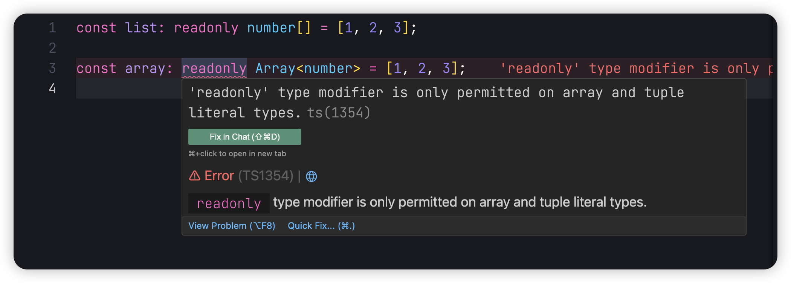
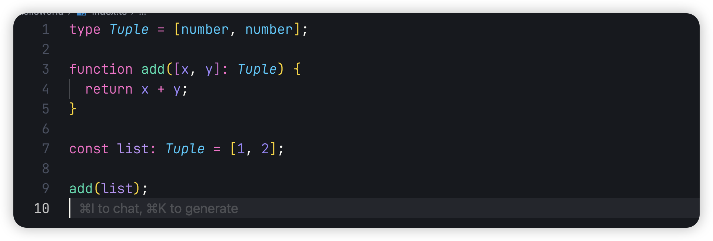
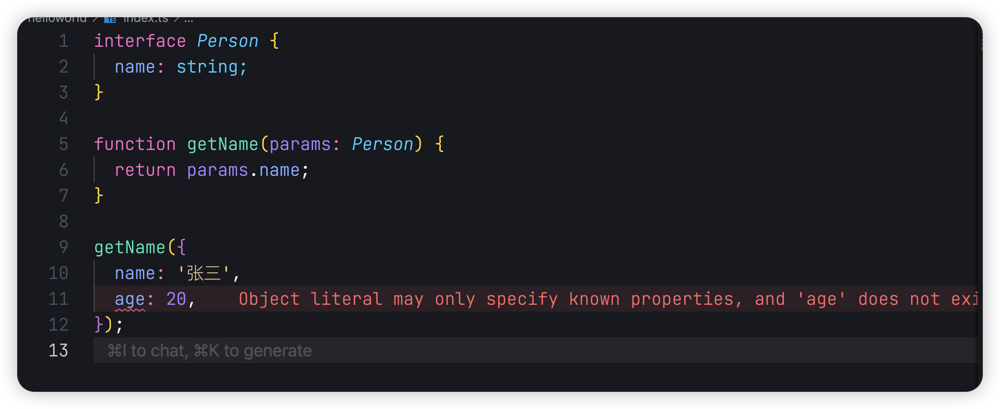
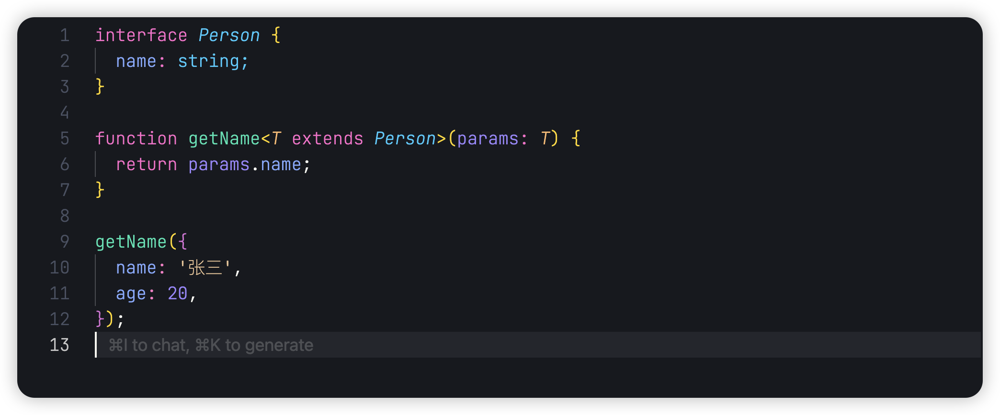
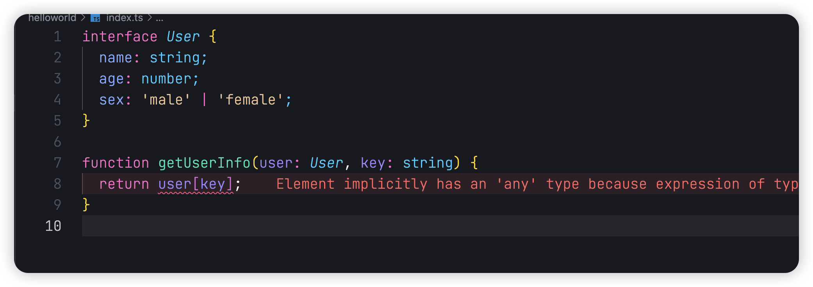

## 前言

Hello，大家好，我是三棵杨树~

欢迎阅读 **TypeScript 从零开始** 系列文章第四篇！在前几篇文章中，我们深入学习了 TypeScript 的基础类型，包括接口、类型别名、字面量类型、类型注解与类型推断等内容。本篇文章将进一步探索 TypeScript 中的高级类型特性：泛型、数组与元组。

通过本篇文章，您将了解如何定义数组类型、使用元组约束数组结构，以及通过泛型实现灵活的类型约束和扩展。泛型是 TypeScript 中最强大的特性之一，也是提升代码可复用性和类型安全的重要工具。

让我们开始我们的 TS 学习之旅吧！

## 数组类型

在第二章中，我们已经学习了如何定义数组类型。在 TypeScript 中，可以使用两种方式为数组定义类型：

```typescript
// 使用类型注解
const numList: number[] = [1, 2, 3];

// 使用泛型
const numArray: Array<number> = [1, 2, 3];
```

### 多维数组

TypeScript 支持定义多维数组：

```typescript
// 二维数组
const numList: number[][] = [[1], [2], [3]];

// 使用泛型定义二维数组
const numArray: Array<Array<number>> = [[1], [2], [3]];

// 多维数组就是不断的在后面累加即可
const threeDimensionalArray: number[][][] = [
  [
    [1, 2, 3],
    [4, 5, 6],
    [7, 8, 9],
  ],
  [
    [10, 11, 12],
    [13, 14, 15],
    [16, 17, 18],
  ],
  [
    [19, 20, 21],
    [22, 23, 24],
    [25, 26, 27],
  ],
];
```

### 只读数组

如果我们想让数组只读的话，在类型前面添加 `readonly` 即可，不过要注意的是`readonly`不支持泛型的写法


## 元组

元组是 TypeScript 中对数组结构的强约束，可以严格定义数组的长度和每一项的类型：

```typescript
type Tuple = [number, string, boolean];

const tuple: Tuple = [1, '2', true];
```

不过在使用元组时也会遇到一些坑，这里举个例子

```typescript
type Tuple = [number, number];

// 这是使用解构的语法
function add([x, y]: Tuple) {
  return x + y;
}

add([1, 2]);
```

这样一看好像，没有什么问题，但是如果我们把数组赋值给一个参数，在传入函数，我们发现 TypeScript 报错了，这是为什么呢？

这是因为我们直接把数组传递给`list`，TypeScript 会自动把`list`的类型推导成`number[]`，而`number[]`是不能传递给元组的，这是因为这个类型的参数，数组项并不固定，而元组是更明确的数组，所以我们必须手动给`list`进行类型注解



## 泛型

在上面的数组中我们已经初步得知了泛型，泛型可以说是 TypeScript 类型里最重要的东西了，那么如何使用泛型呢？

```typescript
function test(a: number, b: number): Array<number> {
  return [a, b];
}
```

如果我们想扩展这个函数，让他也支持 string，这个时候我们就可以使用泛型`<T>`， 这里的`T`是一个占位符，他可以是任意字符

```typescript
function test<T>(a: T, b: T): Array<T> {
  return [a, b];
}

test<number>(1, 2);

test<string>('hello', 'world');

// 我们也可以省略调用函数时传入的类型
test(true, false);
```

这样当我们调用函数的时候，就可以传入对应的类型，TypeScript 会自动把我们传入的类型替换掉`T`这个占位符

我们也可以使用泛型来扩展生成新的类型

```typescript
type orNull<T> = T | null;

const result: orNull<string> = 'hello';
```

这个时候我们就可以使用这个新的类型来约束值，必须是`string`或者`null`。我们可以使用泛型来轻松生成很多新的类型，泛型也是 TypeScript 类型体操的重要组成部分，这部分在我们讲到类型体操的部分详细说。

### extends

`extends` 可以对泛型进行约束，例如在下面的例子中，我们想要获取`name`这个属性的值，我们可以创建一个`Person`类型，并将要获取`name`的值传入函数。

但是这个时候会有一个问题，如果我们传递的参数上有多余的属性，TypeScript 就会报错，我们如果想要解决这个报错，就需要再`Person`上添加对应属性的类型。那我们不可能每有一个新的属性，就添加到`Person`上，这个时候我们就可以使用 `extends` 对传入的类型进行约束。


我们并不关心传入的参数上面有哪些值，我们只关心它是否有 `name` 这个属性。通过 `extends` 我们就可以约束类型，告诉 TypeScript 只检测传入的参数上是否有我们需要的属性。

### keyof

我们来看这样一个例子，我们设置了一个 `User` 类型，并且写了一个函数来获取用户的某一项信息，我们通过 `key` 来接收要获取哪一项信息。但是这个时候 TypeScript 报了一个错误，告诉我们这样是不安全的，因为有可能传入 `User` 中没有的信息项，我们该如何约束 `key` 让它只能是已有的信息项。


我们可以使用 `keyof` 来获取用户存在的信息项，并且通过上面的 `extends` 来约束类型

```typescript
interface User {
  name: string;
  age: number;
  sex: 'male' | 'female';
}

function getUserInfo<T extends keyof User>(user: User, key: T) {
  return user[key];
}

const user: User = {
  name: '张三',
  age: 20,
  sex: 'male',
};

getUserInfo(user, 'name');
```

通过 `keyof` 我们就可以获取 user 对象上存在的属性 `name`、`age`、 `sex`，当我们调用函数的时候，通过上面的类型约束，我们只能传入存在的类型，这样就不会出现获取不存在的信息项的错误了。

## 总结

在本文中，详细介绍了 TypeScript 中的数组类型、元组的使用及其与类型推断的潜在问题，以及泛型的基本使用和高级特性（如 `extends` 和 `keyof`）。这些内容是 TypeScript 中的核心特性，能够显著提升代码的灵活性、复用性和类型安全性。

希望通过这篇文章，您对 TypeScript 的高级类型特性有了更深的理解。在后续的文章中，我们将继续探讨 TypeScript 类型系统的更多技巧和实践。

如文章有错误或者不严谨的地方，期待给于指正，万分感谢。

如果你喜欢这篇文章或者有所启发，欢迎 👉 [三棵杨树](https://github.com/sankeyangshu)，给作者一些鼓励吧！

> 本文源文件都放在了  [Github](https://github.com/sankeyangshu-labs/typescript-study)  上，如果您觉得我写得还不错，希望您能给**❤️ 这篇文章点赞 [Github](https://github.com/sankeyangshu-labs/typescript-study)加星 ❤**️ 哦~
